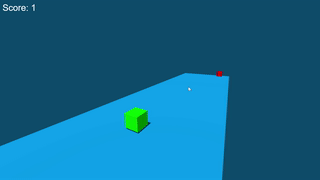

<h1 align="center">Cube Surfer</h1>

  

    3D game using three.js
     
     
    <a href="https://azimovs.github.io/cube-surfer/">View Demo</a>
    ·
    <a href="https://github.com/AzimovS/cube-surfer/issues">Report Bug</a>
    ·
    <a href="https://github.com/AzimovS/cube-surfer/issues">Request Feature</a>
  

<!-- ABOUT THE PROJECT -->

  

A browser game where players control a cube that slides on the ground and must avoid obstacles.
The game was developed with the [tutorial](https://www.youtube.com/watch?v=sPereCgQnWQ&ab_channel=ChrisCourses) by Chris Courses. The additional features and fixes implemented by me:
* Added scores on the top-left corner
* Added end-game screen
* Added an opportunity to restart the game
* Added another end scenario, which is to finish if the cube falls
* Removed enemies that were passed
* Removed the possibility of jumping multiple times

### Built With
* [three.js](https://threejs.org/)
